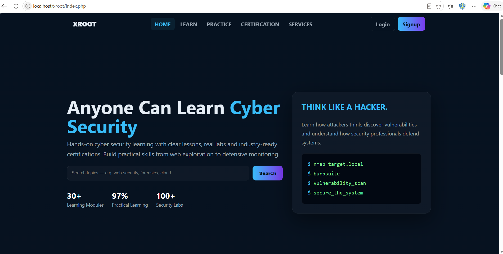
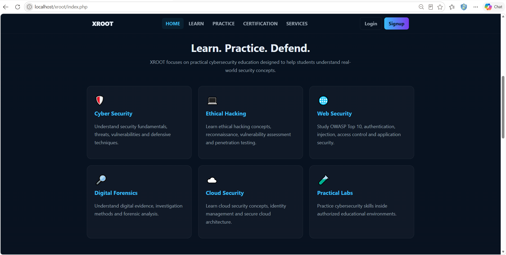
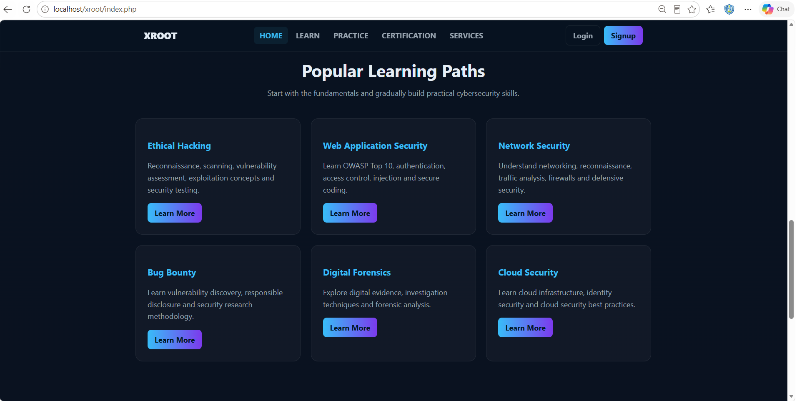
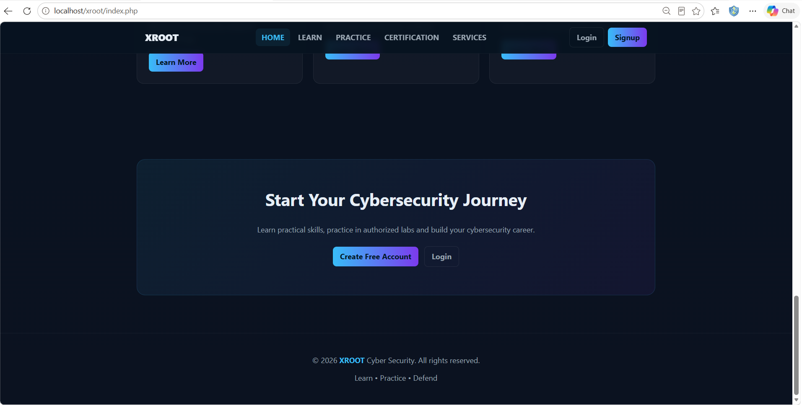
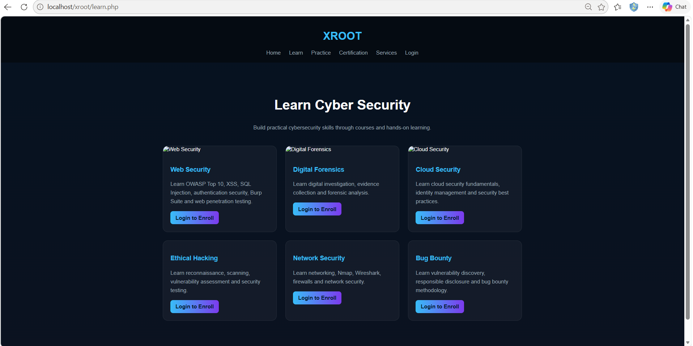
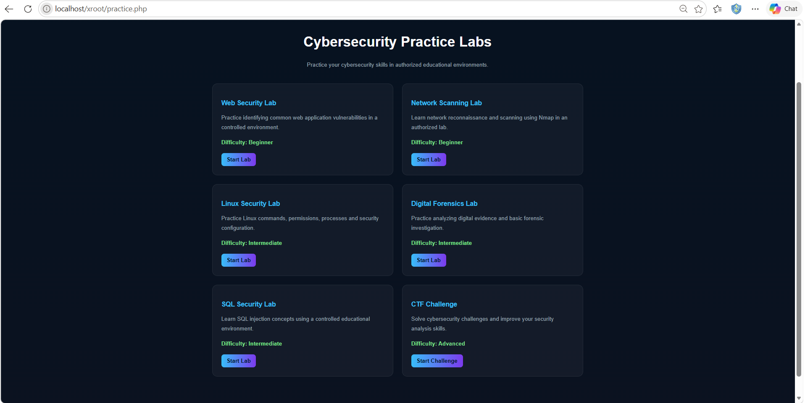
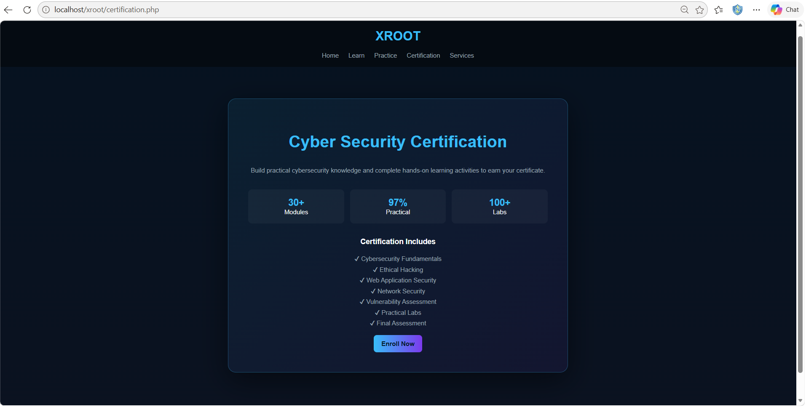
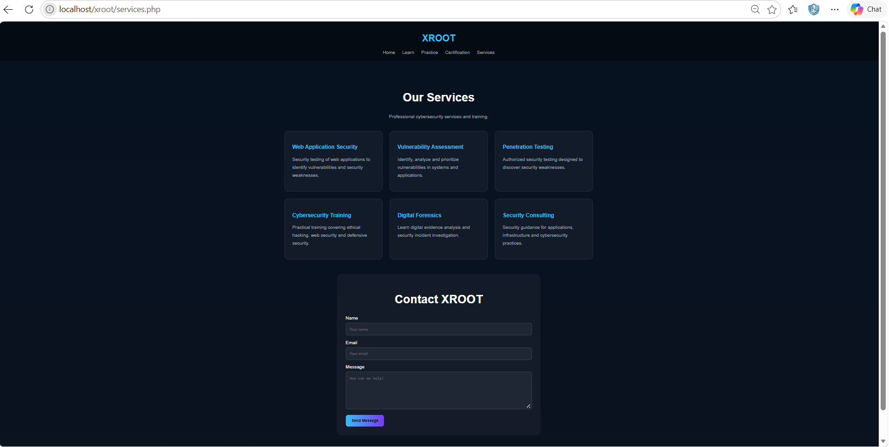
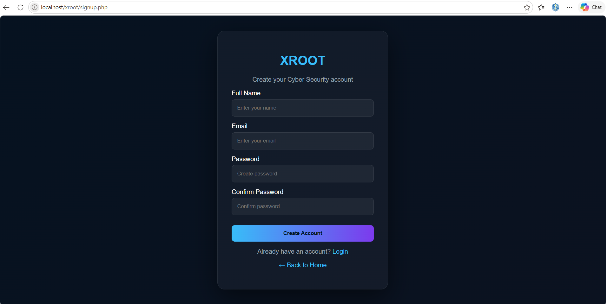
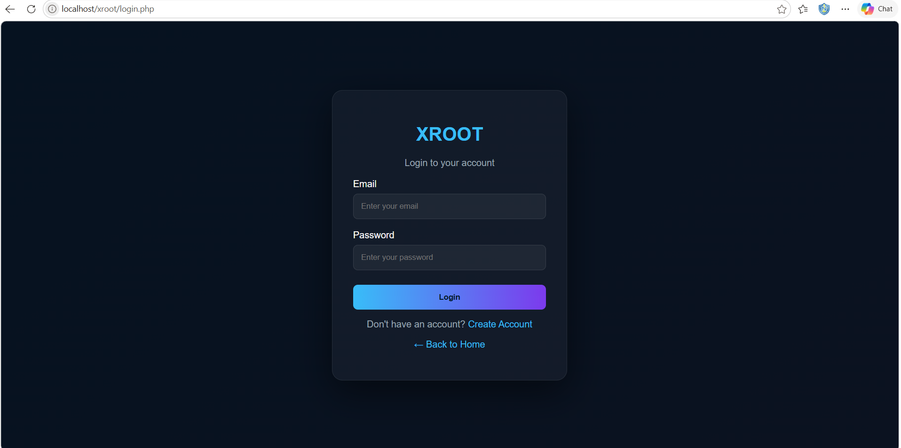

# XROOT - Cyber Security Learning Platform

A PHP and MySQL based web application developed as a college project. XROOT is designed as a cybersecurity learning platform where users can explore cybersecurity services, certifications, learning resources, and practical security topics.

## 🚀 Features

- User Registration and Login
- User Dashboard
- Cybersecurity Learning Resources
- Certification Information
- Cybersecurity Services
- Practical Security Topics
- Database-driven content
- Responsive Web Interface

## 🛠️ Technologies Used

- PHP
- MySQL
- HTML5
- CSS3
- JavaScript
- XAMPP
- Visual Studio Code

## 🗄️ Database

The project uses MySQL for storing application data.

**Database Name:**

`xroot_db`

The project was developed and tested locally using XAMPP.

## 💻 Local Installation

### 1. Install XAMPP

Install XAMPP with Apache and MySQL.

### 2. Clone the Repository

```bash
git clone https://github.com/rangrejsuzan14/xroot-website.git
```

### 3. Place the Project

Place the project folder inside:

```text
C:\xampp\htdocs\
```

The final location should be:

```text
C:\xampp\htdocs\xroot
```

### 4. Start XAMPP

Open XAMPP Control Panel and start:

- Apache
- MySQL

### 5. Configure the Database

Open phpMyAdmin:

```text
http://localhost/phpmyadmin/
```

Create the database:

```text
xroot_db
```

Import the required database tables/data if a SQL database export is provided with the project.

### 6. Run the Website

Open:

```text
http://localhost/xroot/
```

## 📸 Screenshots

### 🏠 Homepage



### 🏠 Homepage - View 2



### 🏠 Homepage - View 3



### 🏠 Homepage - View 4



### 📚 Learning Page



### 🧪 Practice Page



### 🏆 Certification Page



### 🛡️ Services Page



### 📝 Signup Page



### 🔐 Login Page



## 📂 Project Structure

```text
xroot-website/
│
├── index.php
├── login.php
├── signup.php
├── dashboard.php
├── certification.php
├── services.php
├── learn.php
├── practice.php
├── enroll.php
├── logout.php
├── db.php
│
├── cloud.jpg
├── forensics.jpg
├── web.jpg
├── logo..jpg
│
├── homepage.png
├── homepage1.png
├── homepage2.png
├── homepage3.png
├── learn.png
├── practice.png
├── certification.png
├── services.png
├── signup.png
└── login.png
```

## 🎯 Project Objective

The objective of this project is to develop a web-based cybersecurity learning platform that provides users with access to cybersecurity-related learning resources, services, certifications, and practical content.

## 🔐 Security Considerations

This project was developed and tested in a local XAMPP environment for educational purposes.

Potential future improvements include:

- Password hashing
- Strong input validation
- SQL injection prevention
- Secure session management
- Role-based access control
- CSRF protection
- Improved authentication security

## 🚀 Future Improvements

- Online deployment
- User profile management
- Admin dashboard
- More cybersecurity learning modules
- Online certification system
- Improved authentication and authorization
- Enhanced database security
- Mobile-friendly improvements

## 👩‍💻 Developer

**Suzan Rangrej**

Computer Science | Cybersecurity

## 📌 Project Status

**Completed — College Project**

---

⭐ If you find this project useful, consider giving it a star!
